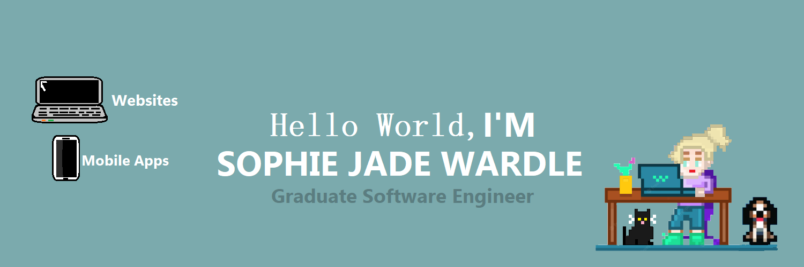

<h1>Sophie Wardle</h1>

**'Software Engineering July 2023 Graduate'**

### Hi there 👋

✨ I'm a developer and recent graduate with experience in both frontend and backend. I have worked on a variety of projects, which I'm working to showcase on GitHub, from both ground up and in collaboration with other developers and stakeholders from the university. I love solving problems with code and I'm excited to start on more new projects! ✨

    

<!--
**SophieWardle/SophieWardle** is a ✨ _special_ ✨ repository because its `README.md` (this file) appears on your GitHub profile.

Here are some ideas to get you started:

- 🔭 I’m currently working on ...
- 🌱 I’m currently learning ...
- 👯 I’m looking to collaborate on ...
- 🤔 I’m looking for help with ...
- 💬 Ask me about ...
- 📫 How to reach me: ...
- 😄 Pronouns: ...
- ⚡ Fun fact: ...
-->
